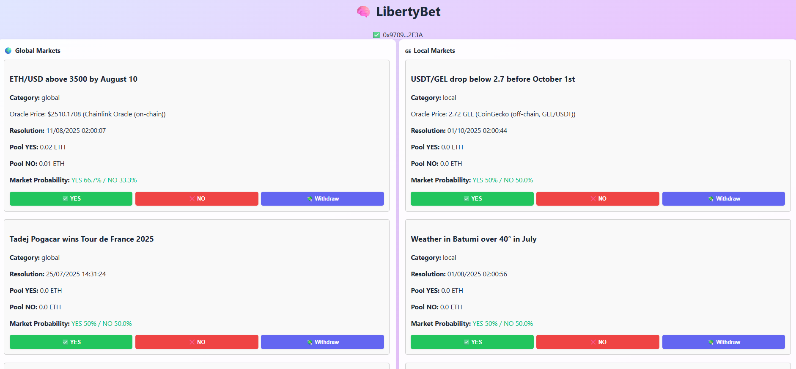

🧠 LibertyBet

A decentralized prediction market inspired by Polymarket, designed for “local” markets (here: Georgia 🇬🇪, but extendable to other liberal countries): predict global and local events, win ETH, and help reveal “skin in the game” collective intelligence on any topic!

🚀 Project Overview
Interface preview

LibertyBet offers:

On-chain prediction markets resolved by oracles, for both global events (e.g., ETH/USD, US elections…) and local events (e.g., GEL/USDT FX, weather, Georgian politics…)

A hybrid oracle system:

- Chainlink for global assets (ETH/USD)
- CoinGecko for local markets (e.g., GEL/USDT, Batumi weather, politics…)

Scalable architecture: each country can have its own local “LibertyBet,” with tailored marketing and dedicated pools.

A minimalist user experience: connect your wallet, select a market, bet “YES/NO,” and withdraw your winnings at market resolution.

LibertyBet primarily targets liberal countries (Georgia, Armenia, Panama…) where betting is culturally valued and lightly regulated.

✨ Key Features

- Local & global markets: each market can have its own resolution (local or global oracle)
- On-chain prediction: transparent pools, no KYC
- Hybrid oracles: Chainlink (on-chain) + CoinGecko (off-chain)
- Dynamic probability: each market displays the real-time implied probability calculated from the betting pools
- Fast UX: Connect Wallet, Bet, Withdraw
- Business scalability: each country can host its own version, monetized through fees on market creation or betting volume

💻 Stack & Architecture

- Frontend: React + ethers v6
- Smart Contracts: Solidity, deployed on Sepolia (switchable to mainnet)

Oracles:

- Chainlink for ETH/USD (on-chain, secure)
- CoinGecko API for GEL/USDT and other local assets (off-chain, fallback)

Dev Tools: Hardhat, unit tests

UI/UX: Responsive, ergonomic, optimized for quick betting

🏦 Business Model & Vision

- Scalability: any “liberal” country (light regulation, betting-friendly, minimal KYC) can run its own LibertyBet instance with adapted markets
- Skin in the game: local prediction markets with real money are the most reliable sources of information (see Polymarket)
- Roadmap: open market creation to everyone (for a fee), add more oracles, reputation badges, Web3 extensions

🛠️ Installation & Getting Started

Clone the repo

git clone https://github.com/DenoyelSeb/LibertyBet.git
cd LibertyBet

Install dependencies

npm install

Deploy smart contracts on Sepolia

npx hardhat run scripts/deploy.js --network sepolia

Create markets (example script provided)

npx hardhat run scripts/createMarkets.js --network sepolia

Start the frontend

npm start

Go to localhost:3000 and use MetaMask (Sepolia network)

🧪 Demo & Screenshots
Screenshots in the /demo folder
(or add a Loom/YouTube video link here if you want)

⚡ Limitations / Next Steps
CoinGecko oracle is subject to API limits (CORS/rate limit → wait 1h if you see “429 Too Many Requests”)

Withdrawals are only available after the market resolution date and once the market is resolved

Next: allow anyone to create markets (“propose your own market”), add more oracles, open source

🏅 Why LibertyBet?
A local alternative to Polymarket, tailored to the Georgian mindset (and scalable worldwide)

Unique hybrid oracle system in this segment

Dynamic probabilities, full transparency, fast UX

Scalable business model and viral “bottom-up” potential via local communities

🙋‍♂️ Contact
Developed for ETHGlobal, 2024.
Repo: github.com/DenoyelSeb/LibertyBet
Feel free to contact for Web3/Fintech collabs or feedback!